# Event Detection in Finance by Clustering News and Tweets


**Authors:** Roland DUTAUZIET & Maeva N'GUESSAN

**Program:** Master 2 MOSEF - Data Science (Modélisations Statistiques Économiques et Financières) - 2025/2026  

## Abstract

This project reproduces and extends the methodology of Carta et al. (2021) for detecting financial events by clustering news articles and measuring their resonance on social media.  

Applied to the S&P 500, financial news and tweets in 2023, the pipeline combines dynamic lexicon generation, document embeddings, hierarchical clustering, and tweet-based alert generation.  

The objective is to automatically identify significant market events and evaluate detection performance against real S&P 500 price movements.

---

## Project Architecture

The repository is structured to ensure reproducibility and clean code separation.

```text
Financial-Events-clustering-news-tweets  
├── data/  
│   ├── for_models/  
│   │   ├── output/  
│   │   │   ├── table_3_tweet_assignment_AI.csv        # Tweet–cluster assignments (IPO ARM, Sept 2023)  
│   │   │   ├── table_3_tweet_assignment_SVB.csv       # Tweet–cluster assignments (SVB crisis, March 2023)  
│   │   │   ├── final_event_signatures_AI.csv          # Clean cluster centroids (AI/ARM period)  
│   │   │   ├── final_event_signatures_SVB.csv         # Clean cluster centroids (SVB period)  
│   │   │   ├── news_features.csv                      # 300D GloVe embeddings (news)  
│   │   │   ├── tweets_features.csv                    # 300D GloVe embeddings (tweets)  
│   │   │   └── tweets_assigned.csv                    # Final tweet-to-event assignments  
│   │   └── processed/  
│   │       ├── news_2023_clean.csv                    # Cleaned financial news dataset  
│   │       ├── tweets_2023.csv                        # Filtered financial tweets  
│   │       ├── sp500_2023.csv                         # Daily S&P 500 prices (ground truth base)  
│   │       └── daily_lexicons_filtered/               # Dynamic financial lexicons (P20/P80)  
│
├── docs/  
│   ├── Carta_et_al_2021.pdf                           # Reference paper  
│   ├── Rapport_Event_detection.pdf                    # Academic report  
│   └── Slides_Quant_Finance.pdf                       # Presentation slides  
│
├── img/  
│   ├── 1_lexicon_generation/  
│   ├── 2_feature_engineering/  
│   ├── 3_news_clustering/  
│   ├── 4_outlier_removal/  
│   ├── 5_relevant_words_extraction/                  
│   ├── 6_event_signatures/  
│   ├── 7_tweet_assignment/  
│   └── 8_alert_generation/  
│
├── notebooks/  
│   ├── 1_lexicon_generation.ipynb  
│   ├── 2_feature_engineering.ipynb  
│   ├── 3_news_clustering.ipynb  
│   ├── 4_outlier_removal.ipynb  
│   ├── 5_relevant_words_extraction.ipynb              
│   ├── 6_event_signatures.ipynb  
│   ├── 7_tweet_assignment.ipynb  
│   └── 8_alert_generation.ipynb  
│
├── src/  
│   ├── lexicon_generation.py        # Marginal Screening + dynamic lexicon  
│   ├── feature_engineering.py       # GloVe embeddings (news & tweets)  
│   ├── news_clustering.py           # HAC + silhouette optimization  
│   ├── outlier_removal.py           # Silhouette + cosine filtering  
│   ├── relevant_words_extraction.py # TF-IDF keyword extraction per cluster  
│   ├── event_signatures.py          # Median-based cluster centroids  
│   ├── tweet_assignment.py          # Cosine similarity (threshold-based)  
│   └── alert_generation.py          # Social Heat + Precision/Recall/F-score  
│
├── pyproject.toml  
├── uv.lock  
├── LICENSE  
└── README.md  
```

---

## Installation & Setup

We use uv, an extremely fast Python package and project manager written in Rust, to handle our virtual environment and dependencies.

### 1. Install uv
If you haven't installed uv yet, run:

```Bash
# On Windows (PowerShell)
pip install uv
# On macOS/Linux
curl -LsSf [https://astral.sh/uv/install.sh](https://astral.sh/uv/install.sh) | sh
```
### 2. Setup the Virtual Environment
Navigate to the project directory, create and activate the environment:

```Bash
cd Financial-Events-clustering-news-tweets
uv venv
# Windows:
 .venv\Scripts\activate
# macOS/Linux:
source .venv/bin/activate
```
3. Install Dependencies
Install the required packages (Pandas, Numpy, Scikit-learn, Plotly, SciPy, Gensim):

```Bash
uv sync
```

---

# Methodology & Pipeline

Our framework follows a 7-step architecture inspired by the original paper, adapted to the 2023 market environment.

---

# Step 1 — Lexicon Generation

We build a **dynamic financial lexicon** using Marginal Screening on a rolling window of news articles.

Each word receives a score:

$$
f(j) = \frac{1}{N} \sum_{k=1}^{N} X_k^{(j)} \cdot \delta_k
$$

Words strongly correlated with market returns (top/bottom percentiles) are retained, while neutral words are discarded.

<p align="center">
  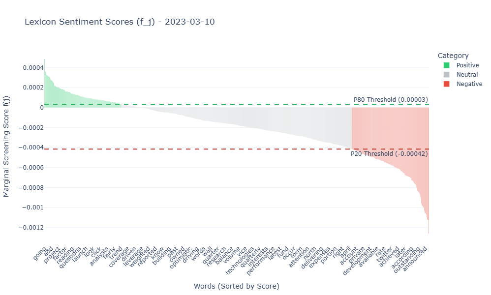
</p>


---

# Step 2 — Feature Engineering

Each article is converted into a dense vector representation.

- Text is cleaned and filtered using the daily lexicon.
- Pre-trained 300D word embeddings (GloVe) are used.
- The document vector is computed as:

$$
v_a = \frac{1}{|W_a|} \sum_{w \in W_a} \text{Embedding}(w)
$$

This transforms textual information into numerical form for clustering.

<p align="center">
  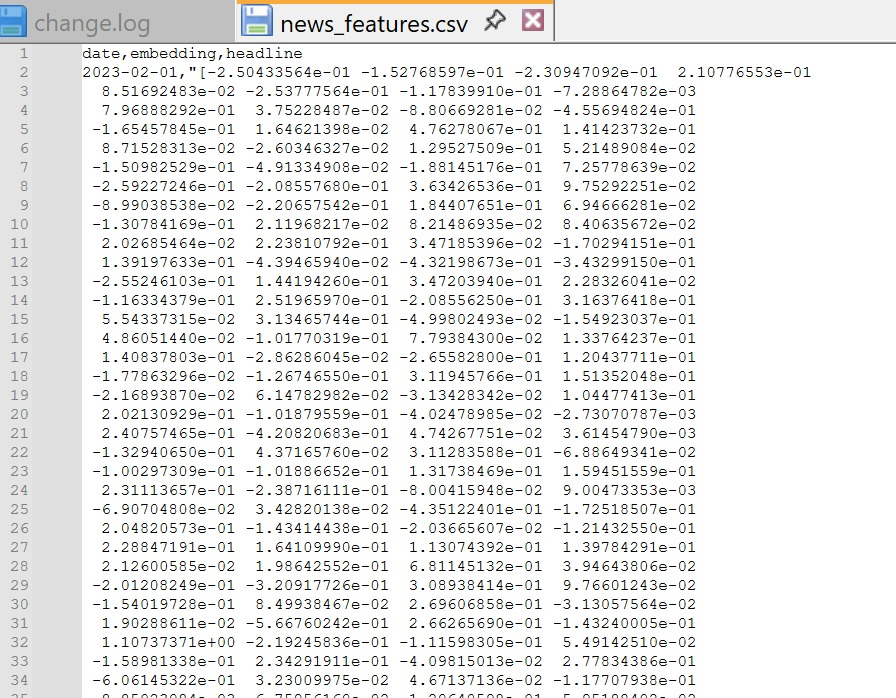
</p>
---

# Step 3 — News Clustering

News embeddings are grouped into candidate events.

We tested several algorithms (K-Means, HAC, etc.) and selected the optimal number of clusters via **Silhouette Score maximization**:

$$
s(i) = \frac{b(i) - a(i)}{\max(a(i), b(i))}
$$

Hierarchical Agglomerative Clustering (cosine distance + average linkage) consistently produced the most coherent clusters.

<p align="center">
  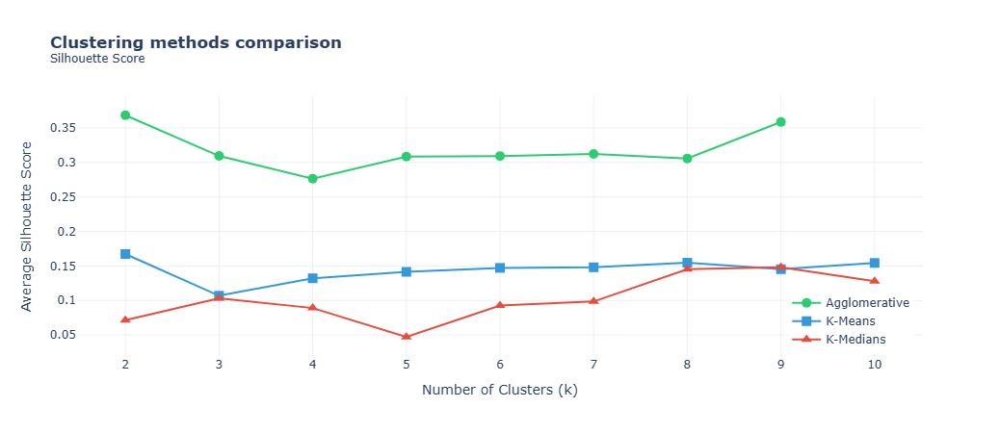
</p>
<p align="center">
  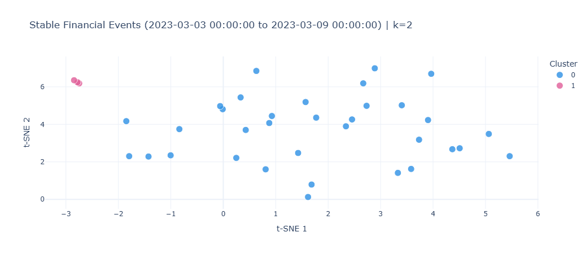
</p>
<p align="center">
  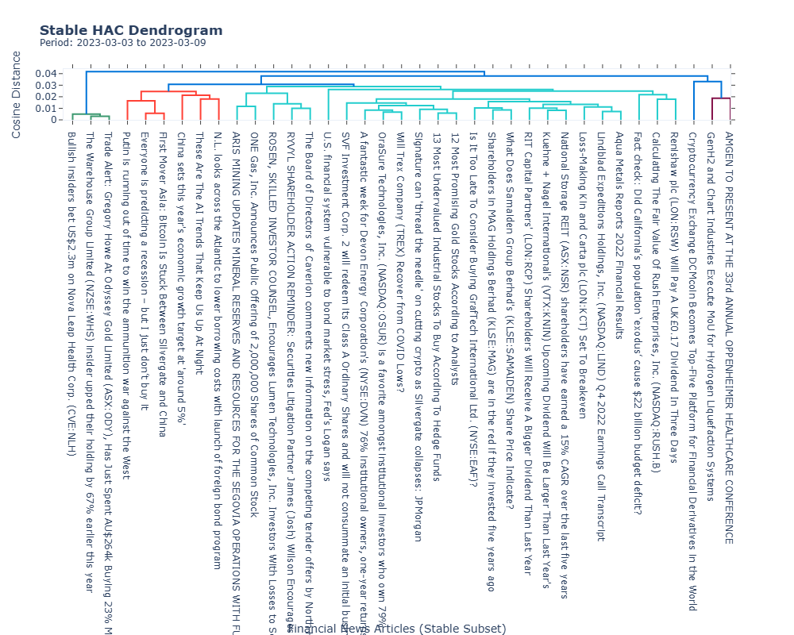
</p>
---

# Step 4 — Relevant Words & Cleaning

To ensure interpretability:

- We extract top financial terms per cluster using TF-IDF.
- Outliers are removed using silhouette and centroid similarity thresholds.

Only semantically coherent financial clusters are retained.

<p align="center">
  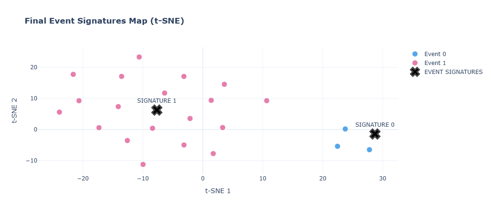
</p>
<p align="center">
  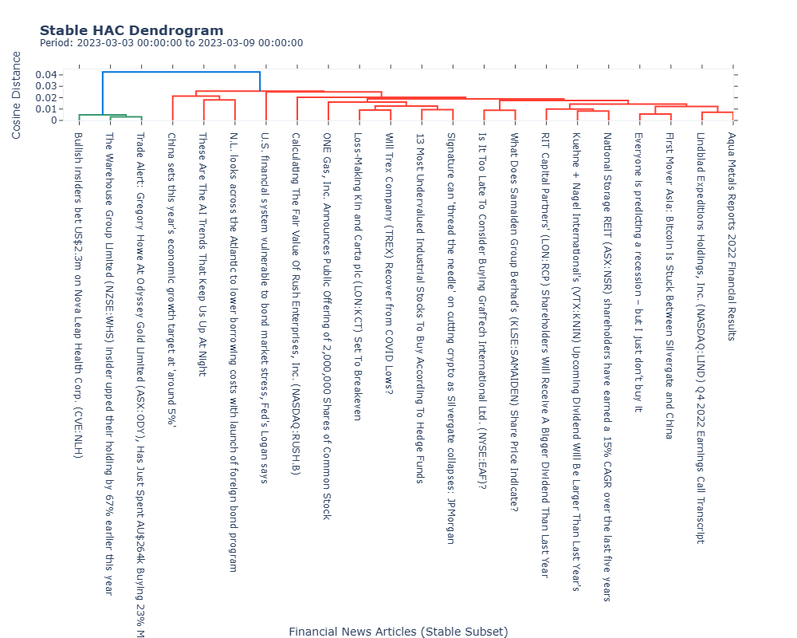
</p>

---

# Step 5 — Relevant Words Extraction (TF-IDF)

We extract representative financial keywords for each cluster using **TF-IDF weighting**:

$$
\text{TF-IDF}(t,c) = \text{TF}(t,c) \times \log\left(\frac{N}{DF(t)}\right)
$$

Where:

- \( t \) = term  
- \( c \) = cluster  
- \( N \) = total number of documents  
- \( DF(t) \) = document frequency of term \( t \)

This step improves cluster interpretability and ensures that detected events are characterized by financially meaningful vocabulary.

<p align="center">
  
</p>
---

# Step 6 — Tweet Assignment

Tweets are embedded using the same model and compared to event signatures using cosine similarity:

$$
\text{sim}(t, c_k) = \frac{t \cdot c_k}{\|t\| \|c_k\|}
$$

Tweets with similarity above a threshold are assigned to the event.

<p align="center">
  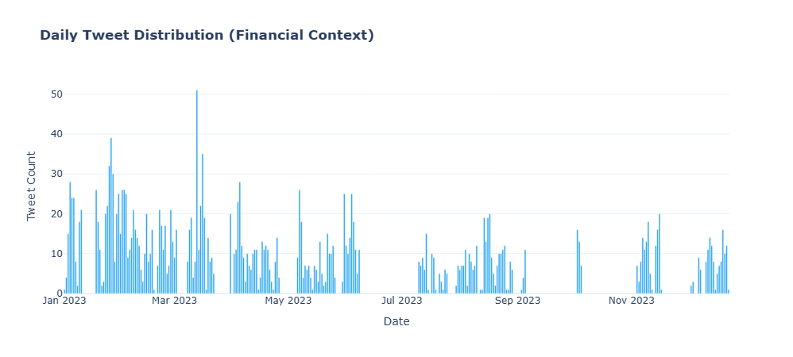
</p>
<p align="center">
  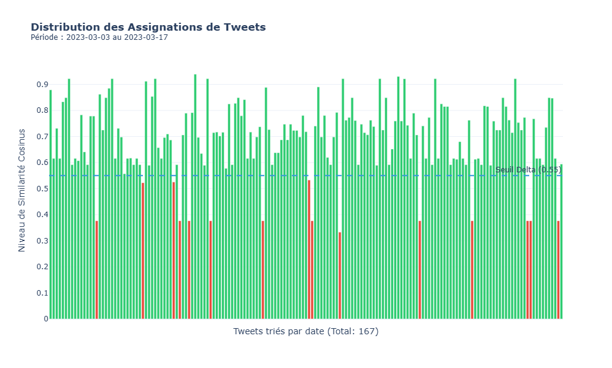
</p>
---

# Step 7 — Alert Generation & Evaluation

We define **Social Heat** as:

$$
R(d) = \frac{\text{Assigned Tweets}_d}{\text{Total Tweets}_d}
$$

An alert is triggered when:

$$
R(d) > \theta
$$

### Ground Truth

Market event intervals are defined using weekly S&P 500 variation:

$$
\Delta_d = \frac{|close(d+7) - close(d)|}{close(d)}
$$

Days where:

$$
\Delta_d > 0.02
$$

are labeled as event periods.

We evaluate performance using **Precision, Recall, and F-Score**.

<p align="center">
  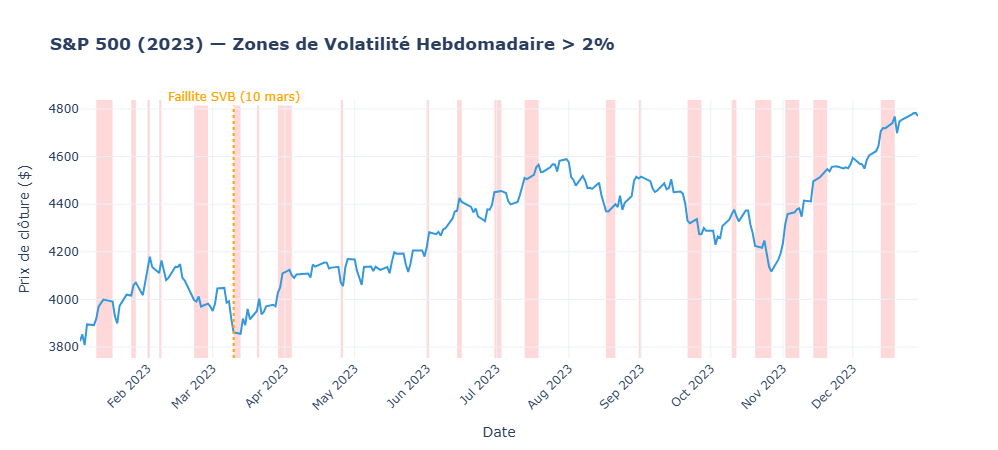
</p>
<p align="center">
  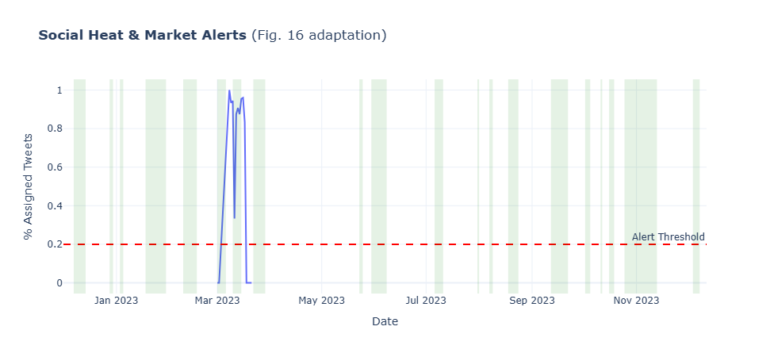
</p>

---

# Case Studies (2023)

### Silicon Valley Bank Collapse (March 2023)
Detected strong social amplification prior to major market drawdown.

### ARM IPO (September 2023)
Identified anticipation and immediate post-listing reaction.

---

# Key Findings

- **HAC Dominance:** Hierarchical clustering outperformed K-Means and density-based methods.
- **Recall-Oriented Detection:** Capturing major market moves is prioritized over minimizing false alarms.
- **Social Heat Dynamics:** Social activity sometimes anticipates or slightly lags price movements, suggesting potential alpha signals.

---

# Acknowledgments

**Original Paper:**  
Carta, S., et al. (2021). *Event Detection in Finance by Clustering News and Tweets.*

**Institution:**  
Université Paris 1 Panthéon-Sorbonne — Master 2 MOSEF (Quantitative Finance)
